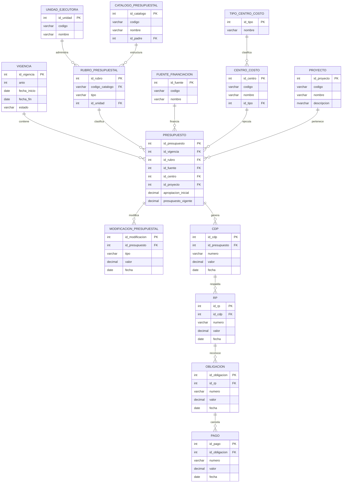

# Sistema de Gestión Presupuestal – Documentación Técnica Completa (SQL Server)

## Descripción General

Este documento describe el diseño completo de la base de datos del **Sistema de Gestión Presupuestal** incluyendo:

- Modelo conceptual
- Diccionario de datos
- Vistas institucionales
- Procedimientos almacenados
- Flujo de ejecución presupuestal
- Diagrama ER en Mermaid

El flujo presupuestal implementado:

```
Apropiación → CDP → RP → Obligación → Pago
```

---

# Arquitectura General

El sistema está organizado en los siguientes módulos:

| Módulo | Función |
|-------|--------|
| Núcleo | Vigencias, unidades ejecutoras |
| Planeación | Apropiaciones |
| Estructura | Catálogo presupuestal |
| Ejecución | CDP, RP |
| Contable | Obligaciones |
| Tesorería | Pagos |
| Control | Modificaciones |

---

# Diagrama Entidad–Relación (Mermaid)



---

# Diccionario de Datos (Resumen)

## vigencia

Controla el periodo fiscal del presupuesto.

Permite:

- apertura presupuestal
- cierre anual
- control histórico

---

## unidad_ejecutora

Representa dependencias autorizadas para ejecutar recursos.

Ejemplo:

- Facultad
- Centro de investigación
- Programa académico

---

## fuente_financiacion

Permite clasificar el origen del recurso:

- Nación
- Recursos propios
- Estampillas
- Convenios

---

## catalogo_presupuestal

Estructura jerárquica del presupuesto institucional.

Ejemplo:

```
2
2.2
2.2.3
2.2.3.01
```

Permite consolidación automática por niveles.

---

## rubro_presupuestal

Define el rubro operativo ejecutable.

Ejemplo:

- Transporte
- Servicios profesionales
- Matrículas

---

## centro_costo

Unidad operativa donde se ejecuta el gasto.

---

## proyecto

Representa programas académicos o proyectos especiales.

---

## presupuesto

Contiene apropiación inicial y vigente.

Es la tabla central del sistema.

---

## modificacion_presupuestal

Registra:

- traslados
- adiciones
- reducciones

Permite trazabilidad normativa.

---

## cdp

Certificado de Disponibilidad Presupuestal.

Reserva recursos antes del compromiso.

---

## rp

Registro presupuestal.

Formaliza el compromiso jurídico.

---

## obligacion

Reconocimiento contable del gasto.

---

## pago

Ejecuta la salida efectiva del recurso.

---

# VISTAS DEL SISTEMA

Las vistas permiten generar reportes estratégicos institucionales.

## vw_presupuesto_vigente

Consolida el presupuesto vigente por rubro y vigencia.

Uso:

- informes rectoría
- informes consejo superior
- reportes financieros

Consulta lógica:

```
SELECT vigencia + rubro + valor vigente
```

Permite conocer el presupuesto activo disponible.

---

## vw_ejecucion_presupuestal

Resume el estado completo de ejecución financiera.

Incluye:

- disponible
- comprometido
- obligado
- pagado

Uso:

Seguimiento financiero en tiempo real.

Ejemplo resultado:

| Rubro | Disponible | Comprometido | Obligado | Pagado |
|------|------------|-------------|---------|-------|

Permite análisis de ejecución presupuestal institucional.

---

## vw_presupuesto_por_unidad

Agrupa presupuesto vigente por unidad ejecutora.

Uso:

- control por facultad
- control por dependencia
- seguimiento descentralizado del gasto

Ejemplo:

| Unidad | Presupuesto vigente |

---

# PROCEDIMIENTOS ALMACENADOS

Los procedimientos almacenados automatizan operaciones presupuestales críticas.

---

## sp_crear_apropiacion

Registra apropiación inicial del presupuesto aprobado.

Parámetros:

| Parámetro | Descripción |
|----------|------------|
| vigencia | Año fiscal |
| rubro | Rubro presupuestal |
| fuente | Fuente financiación |
| centro | Centro costo |
| proyecto | Proyecto asociado |
| valor | Valor aprobado |

Uso:

Carga inicial del presupuesto institucional.

Ejemplo:

```
EXEC sp_crear_apropiacion 2026, 10, 3, 5, 2, 50000000
```

---

## sp_traslado_presupuestal

Permite mover recursos entre rubros.

Uso:

Modificaciones internas sin cambiar total aprobado.

Ejemplo:

```
EXEC sp_traslado_presupuestal 15, 20, 10000000
```

Impacto:

- reduce rubro origen
- incrementa rubro destino

---

## sp_registrar_cdp

Genera certificado de disponibilidad presupuestal.

Uso:

Reserva recursos antes de contratar.

Ejemplo:

```
EXEC sp_registrar_cdp 8, 'CDP-001', 3000000
```

---

## sp_registrar_rp

Formaliza compromiso presupuestal.

Uso:

Registro posterior al CDP.

Ejemplo:

```
EXEC sp_registrar_rp 3, 'RP-045', 2500000
```

---

## sp_registrar_obligacion

Reconoce obligación contable.

Uso:

Registro tras ejecución contractual.

Ejemplo:

```
EXEC sp_registrar_obligacion 5, 'OBL-009', 2500000
```

---

## sp_registrar_pago

Registra pago efectuado.

Uso:

Salida efectiva del recurso desde tesorería.

Ejemplo:

```
EXEC sp_registrar_pago 2, 'PAGO-889', 2500000
```

---

# Flujo Operativo del Sistema

Secuencia institucional:

```
1. Crear apropiación
2. Generar CDP
3. Registrar RP
4. Crear obligación
5. Ejecutar pago
```

Permite control total del ciclo presupuestal.

---

# Ventajas del Modelo

Este modelo permite:

- Control multivigencia
- Control por unidad ejecutora
- Trazabilidad completa del gasto
- Auditoría presupuestal
- Reportes estratégicos
- Escalabilidad tipo ERP universitario


## Previo de nomina

crear un almacenado para generar el previo de nomina que es responsabilidades RP 

## Novedades de nomina Reporte de horas (pagos adicionales a los pagos fijos)
Tabla de nomina individualmente para cada empleado esto lo lo reporta el director del programa o proyecto.

## Novedades estan categorizadas 
Estas se deben manejar de manera individual por que se canculan de manera diferente cada una. 

## Tener en cuenta el valor hora para la liquidacion. 

## Agregar el numero de cuenta 


## Agregar tabla de auditoria En backend 


## Requerimientos Adicionales para la base 

- Agregar Auditoria 
- Agregar carga de archivos 
- agregar el softdelete 
- agregar campos de trazabilidad  por midificaciones 
- Tabla previa nomina 
- nomina 
- Agenda pendientes planificacion? alertas.
- Agregar campos de aprobacion. 